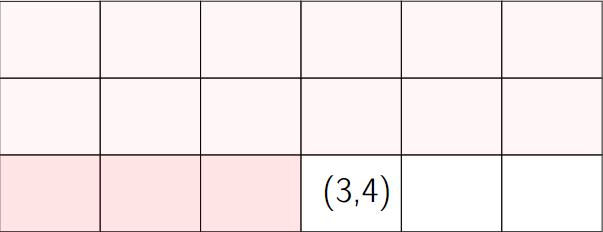

# Arrays and Linked Lists

<br><hr>

## Arrays

Array: contiguous are of memory consisting of equal-size elements indexed by contiguous integers.

\# How to find addres for index **i** (formula):

- array_addr + elem_size * (i - first_index)

<br>

If we do zero based indexing, first index isn't necessary.

<br>

## Question:

Given an array whose:

- adress is 1000
- element size is 8
- first index is 0

What is the address of the element at index 6?

```
= 1000 + 8 * (6-0)
= 1000 + 8 * 6
= 1048
```

<br>

## Multi Dimensional Arrays



<br>

How do we find the address of the element which is row 3, column 4.

- First skip the rows that full rows that we are  not using
   
    - (row_index - initial_row_index) x elem_size_of_one_row
    - (3 - 1) * 6

- Then we gotta skip the elements before (3,4) in the same row. So there are three of them, how do we get that?
    
- We take the column index which is 4 and subtract it from the initial column index.

    - (3 - 1) * 6 + (4 - 1)

- And finally

    - array_addr + elem_size * [(3 - 1) * 6 + (4 - 1)]

<br>

What we are doing is called "row-major ordering" or "row-major indexing".
What we do is basically, we lay out (1,1), (1,2), (1,3), (1,4), (1,5), (1,6) and then right after that in memory (2,1), (2,2), (2,3) and so on. So the column index is changing most rapidly as we're looking at succesive elements. And that's an indication of it's row-major indexing. 

We could lay out arrays differently. We can lay out each column in order, so we'd have the first column and the second column and then the third column. And so that then, the succesive elements would be (1,1), (2,1), (3,1) followed by (1,2), (2,2), (3,2) and so on, So there we can see that the row index is changing most rapidly and this is called "column-major ordering".

<br>

## Question:

Assume you have three-dimensional array laid out in column-major order with the first element at indicates (1,1,1).

What are the indicates of the next element in memory?

- [ ] (1,2,1)
- [ ] (1,1,2)
- [x] (2,1,1)

<br>

## Times for Common Operations

⠀| Add | Remove
| :--- | :---: | :---:
Beginning  | O(n) | O(n)
End  | O(1) | O(1)
Middle  | O(n) | O(n)

O(n) = Order n operation

<br>

\# Note: Huge advantage for arrays is that we have this constant time access to elements, either read or write

<br>

## Order of Magnitude - Big O

This is basically a set of value that helps us understand how many steps it will take any particular algorithm to process a certain number of pieces of data.

<br>

## Big O Table

<br>

N⠀| O(1) | O(logN) | O(N) | O(N*logN) | O(N^2)
:---: | :---: | :---: | :---: | :---: | :---:
2⠀| 1 | 1 | 2 | 2 | 4
3⠀| 1 | 2 | 3 | 6 | 9
4⠀| 1 | 2 | 4 | 8 | 16
6⠀| 1 | 3 | 6 | 18 | 36
10⠀| 1 | 4 | 10 | 40 | 100
50 | 1 | 6 | 50 | 300 | 2500
100⠀| 1 | 7 | 100  | 700 | 10,000
1000⠀| 1 | 10 | 1000  | 10,000 | 1,000,000
2000⠀| 1 | 11 | 2000 | 22,000 | 2,000,000

<br><hr>