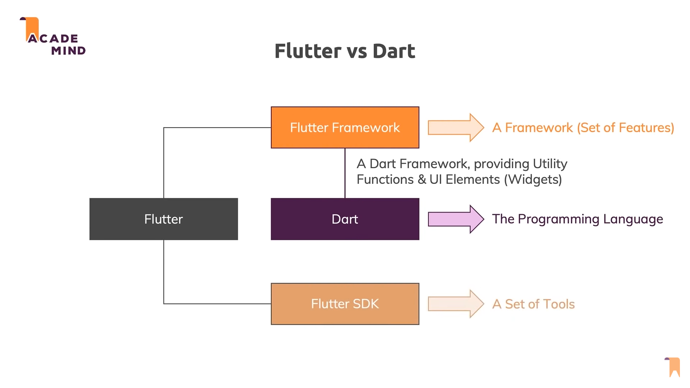
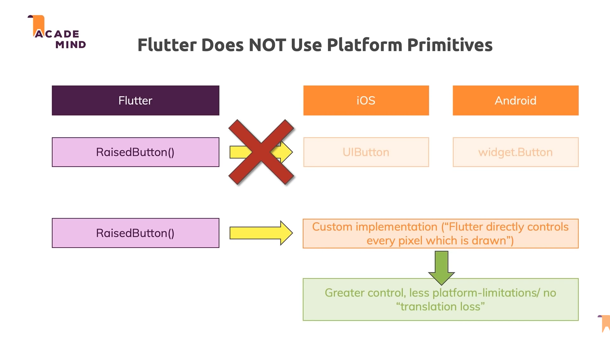
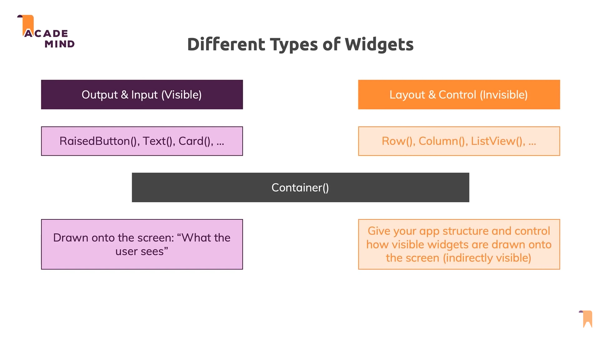
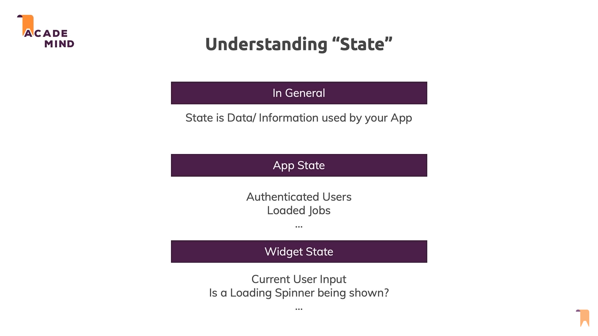
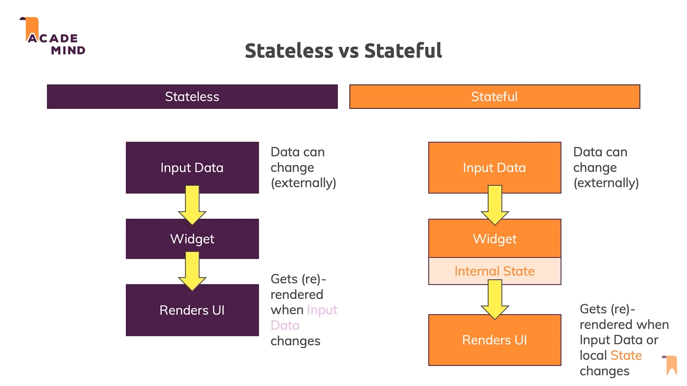
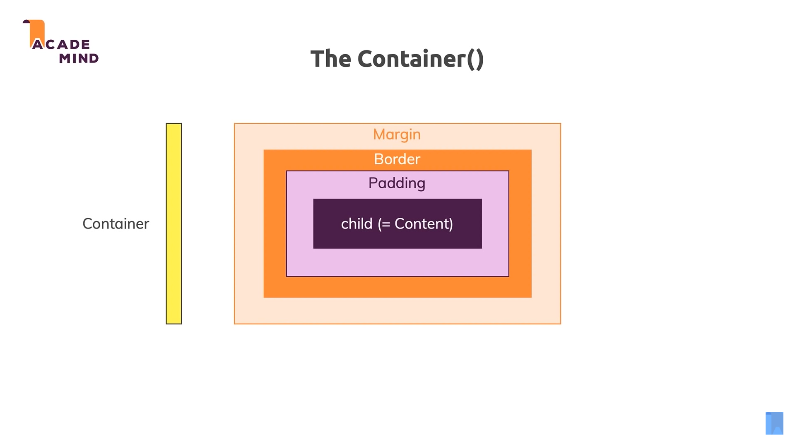

# Flutter Notes

I'll keep taking notes about things to remember while learning flutter. I'll keep this note updated when I take more notes.

 

**Flutter**: A "tool" that allows you to build **native cross-platform** apps with one programming language and codebase

 

**Widget**: Re-usable UI building blocks

 
 
 

Flutter vs Dart

 
 
 

Flutter vs React Native

 

**Warning-1**: You can only extend one class at a time

 

**Warning-2**: Every widget in flutter needs to extend Stateless widget or Stateful widget 

 
 
 

Widgets

 
 
 

Understanding State

 
 
 

Stateless vs Statefull

 
 
 

Container
