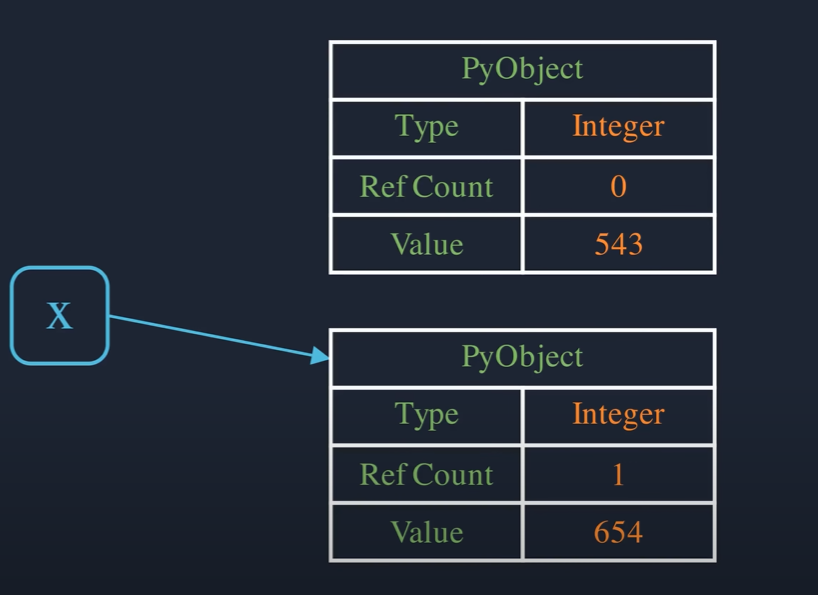

# How Variables Work

First of all everything is an object in Python.
When you initialize a variable a new object will be created in the heap memory.

<br>

So for an example lets create an integer variable named 'x'
```python
x = 543
```


<br>

The PyObject represents the base structure for all python objects.
For now we are just going to focus on ***the type information***, ***reference count*** and ***the actual value***.

<br>

When a new value is assigned to the variable 'x' a new object created at a different memory address and the reference is updated to point to the new object.
At this point reference count of the new object becomes 1 and the old object's becomes 0
 
```python
x = 543
x = 654
```


<br>

Python's memory manager periodically cleans such object with zero reference counts (that means old object is deleting from memory).
This process is called 'Garbage Collection'.

<br>

When a new variable is created by assigning existing variable python doesn't create a new object.
The new variable will another reference to the same object.

```python
x = "Hello World"
y = x
```


<br>

So as you can see, the reference count field of the object becomes two.
If we delete 'x', the reference count will be one but the object is still remain because of the 'y' is still pointing that object.

<br>

## Lists

Instead of PyObject, the basic structure for container type objects is PyVarObject.
PyVarObject is just a pyobject with an additional 'size' field.
The 'size' field is used to store the number of elements.

```python
x = [862,751,932]
```


<br>

The 'value' Field will be a **pointer** to the memory location of the storage array where actual elements are stored.
The elements are not directly stored in this array instead, only pointers to the elements are stored.


<br>

For array indexing to work, each element in the array must have same size.
**The pointer** to any type of object (no matter string, integer, dictionary) will have the same size.
This is why we can store different type of objects in the list in python.

<br>

## Interning

Let's see what happens in the memory when we write this code

```python
x = None
y = None

x == y
```
Output:
```python
True
```

<br>

Like everything else, 'None' is also an object.
We expect that when the first statement is executed a 'None' object is created in memory and 'x' will be a reference to it.
Similarly, when second statement is executed another 'None' object is created and 'y' will be reference to it.  


<br>

However, it doesn't happen that way, a new 'None' object is not created.
Instead, 'y' will be another reference to the existing 'None' object.


<br>

As you can confirm it by using:

```python
hex(id(x)) == hex(id(y))
```
Output:
```python
True
```

Both 'x' and 'y' has the same address since they are reference to the same object.
This is called **Interning** or re-using objects.

<br>

## Equality operators

<br>

```python
x = [1,2,3]
y = [1,2,3]

x == y # True
x is y # False
```

<br>

This is because the '==' operator compares the both list object **elements by elements** but 'is' keyword compares their **address**.